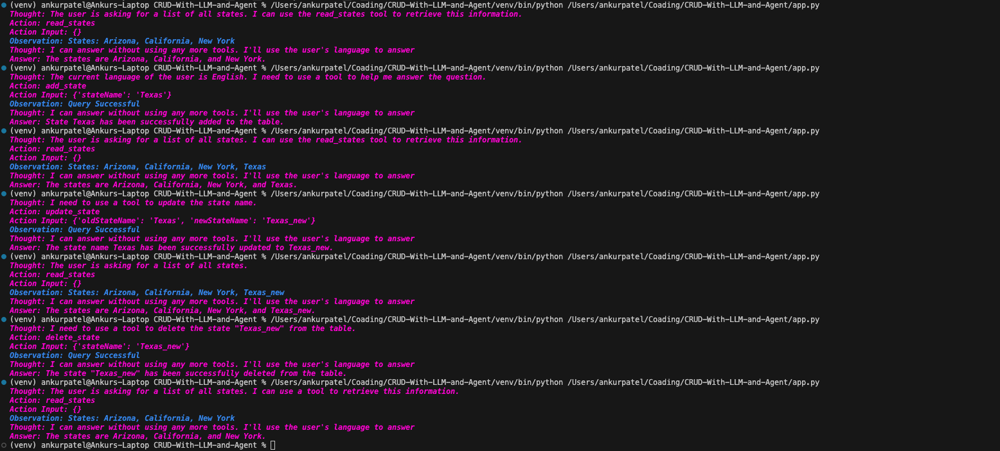

# CRUD-With-LLM-and-Agent
Main focus was to check it's ability to select tools at the run time

#### CRUD appliction on state attribute in state table sql
#### This method with tool can also be used for some update queries if we don't want to execute update queries by sql_agent.

